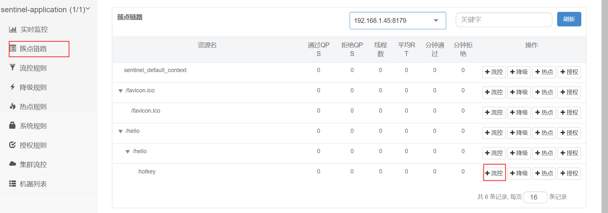
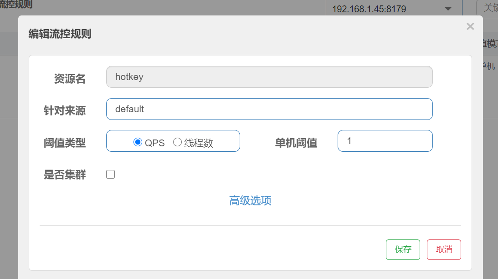
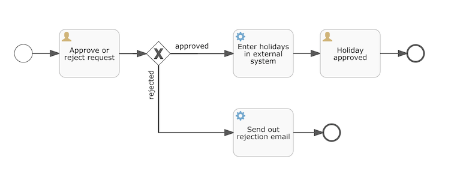

# Spring
### Spring-Cloud-Config
#### SpringCloud使用SpringCloudConfig作为配置中心
```
1. 加入maven依赖
 <dependency>
            <groupId>org.springframework.cloud</groupId>
            <artifactId>spring-cloud-config-server</artifactId>
 </dependency>

2. application配置文件

spring:
  cloud:
    config:
      server:
        git:
          uri: https://github.com/kerlier/fashion-cloud-config.git
          username: kerlier  # 用户名
          password: yang199626  # 密码
      label: dev  # label表示分支
  application:
    name: config   # name必须要有


3. Application类
@EnableConfigServer
@SpringBootApplication
public class Application {
    public static void main(String[] args) {
        SpringApplication.run(Application.class, args);
    }
}

4. 使用
@Value("${info}")
private String version;


```


### Nacos
#### SpringBoot以nacos为配置中心
```
1. 加入Maven依赖
<!-- nacos 依赖 -->
<dependency>
    <groupId>com.alibaba.boot</groupId>
    <artifactId>nacos-config-spring-boot-starter</artifactId>
    <version>0.2.1</version>
</dependency>

2. Application类
主要配置dataId
@SpringBootApplication
@RestController
@NacosConfigurationProperties(dataId = "nacos-config",autoRefreshed=true)
public class Application {
    public static void main(String[] args) {
        SpringApplication.run(Application.class,args);
    }
}

3. 使用
@NacosValue(value = "${name:1}",autoRefreshed = true)
private String info;

@GetMapping("/info")
public String getInfo(){
    return info;
}

4. 配置application.yml
nacos:
  config:
    server-addr: 127.0.0.1:8848
    namespace: 9945916c-1be4-44ab-827a-42433d0b8ff5
server:
  port: 8080


5. 当配置一个配置文件的时候，我们可以使用

   @NacosConfigurationProperties(dataId = "nacos-config",autoRefreshed=true)
   指定唯一一个dataId


   当需要指定多个dataId的时候，我们需要使用
   @NacosPropertySource(dataId = "nacos-config-2", autoRefreshed = true)
   如下：


    @Component
    @NacosPropertySource(dataId = "nacos-config",autoRefreshed = true)
    public class NacosConfig {
    
        @NacosValue(value = "${name}", autoRefreshed = true)
        private String name;
    
        public String getName() {
            return name;
        }
    
        public void setName(String name) {
            this.name = name;
        }
    }

   // 这里的groupId可能没什么用,dataId一样的话，
   // nacos会读取最新修改的配置文件
   // 所以在线上使用的时候，dataId尽可能不一样

   @Component
   @NacosPropertySource(dataId = "nacos-config-2", autoRefreshed = true)
   public class NacosConfig2 {
   
       @NacosValue(value = "${password}", autoRefreshed = true)
       private String password;
   
       public String getPassword() {
           return password;
       }
   
       public void setPassword(String password) {
           this.password = password;
       }
   }
6. 配置nacos

```

### Util
#### ReflectionUtils反射工具类
```
Input input = new Input("test-aaaa");
//查找方法
Method method = ReflectionUtils.findMethod(Input.class, "getName");
//执行方法
Object invoke = ReflectionUtils.invokeMethod(method,input);
```


### 配置Druid
```
Druid页面字段解释:
执行时间分布:
这8个从左到右依次是：
0-1ms次数、
1-10ms次数、
10-100ms次数、
100-1000ms次数、
1-10秒次数、
10-100秒次数、
100-1000秒次数、
大于1000秒次数。


执行+RS时分布是将执行时间+ResultSet持有时间合并监控，
这个能方便诊断返回行数过多的查询。

```

### Nacos作为注册中心

1. 引入maven依赖
```
        <dependency>
            <groupId>org.springframework.boot</groupId>
            <artifactId>spring-boot-starter-web</artifactId>
        </dependency>
        <dependency>
            <groupId>org.apache.dubbo</groupId>
            <artifactId>dubbo-registry-nacos</artifactId>
            <version>2.7.5</version>
        </dependency>
        <dependency>
            <groupId>org.apache.dubbo</groupId>
            <artifactId>dubbo-spring-boot-starter</artifactId>
            <version>2.7.5</version>
        </dependency>
        <dependency>
            <groupId>com.alibaba.nacos</groupId>
            <artifactId>nacos-client</artifactId>
            <version>1.1.3</version>
        </dependency>
```

2. 修改配置文件
```
spring:
  application:
    name: register-consumer
dubbo:
  application:
    name: register-consumer # 指定dubbo的applicationName
  registry:
    timeout: 6000  # 指定调用的超时时间
    address: nacos://127.0.0.1:8848 # nacos的地址
    check: false # 启动时是否检查有提供者
    parameters:  # 这里可以指定不同的namespace,以便于区分不同的环境
      namespace: f809bd6f-e655-4943-b842-4b1b8e0c5157
server:
  port: 8081
```

3. Application类
```
@SpringBootApplication
@EnableDubbo   # 需要添加@EnableDubbo关键字
public class Application {
    public static void main(String[] args) {
        SpringApplication.run(Application.class,args);
    }
}
```
4. 其他调用跟dubbo使用无异


### 使用Sentinel
#####  1. 引入Maven依赖
```
        <dependency>
            <groupId>org.springframework.cloud</groupId>
            <artifactId>spring-cloud-starter-alibaba-sentinel</artifactId>
        </dependency>
```
##### 2.  修改application.yml
```
spring:
  cloud:
    sentinel:
      transport:
        dashboard: localhost:8082
        port: 8179
```
##### 3.  代码使用
```
可以定义一个SentinelExceptionHandler
代码如下：
    public static String blockExceptionHandler( BlockException e) {
        // 不同的异常返回不同的提示语
        if (e instanceof FlowException) {
            return "请求过于频繁，请控制频率";
        } else if (e instanceof DegradeException) {
            return "服务熔断降级了";
        } else if (e instanceof ParamFlowException) {
            return "热点参数限流了";
        } else if (e instanceof SystemBlockException) {
            return "触发系统保护规则";
        } else if (e instanceof AuthorityException) {
            return "触发系统保护规则";
        }
        return "sentinel异常";
    }


真正使用地方：
    @GetMapping("/hello")
    @SentinelResource(value = "hotkey",
            blockHandlerClass = SentinelExceptionHandler.class,
            blockHandler="blockExceptionHandler")
    public String hello(){
        return "hello";
    }
```
##### 4. 定义规则



当流量超过设置值时，会直接报错，报错信息时SentinelExceptionHandler中的设置的值。


### Mybatis-plus使用

##### 1. 引入Maven依赖
```
        <dependency>
            <groupId>mysql</groupId>
            <artifactId>mysql-connector-java</artifactId>
            <scope>runtime</scope>
        </dependency>
        <dependency>
            <groupId>org.projectlombok</groupId>
            <artifactId>lombok</artifactId>
            <optional>true</optional>
        </dependency>
        <!-- mybatis plus 代码生成器 -->
        <dependency>
            <groupId>com.baomidou</groupId>
            <artifactId>mybatis-plus-boot-starter</artifactId>
            <version>3.2.0</version>
        </dependency>
        <dependency>
            <groupId>com.baomidou</groupId>
            <artifactId>mybatis-plus-generator</artifactId>
            <version>3.2.0</version>
        </dependency>
        <dependency>
            <groupId>org.freemarker</groupId>
            <artifactId>freemarker</artifactId>
            <version>2.3.28</version>
        </dependency>
        <dependency>
            <groupId>com.alibaba</groupId>
            <artifactId>fastjson</artifactId>
            <version>1.2.47</version>
        </dependency>
        <dependency>
            <groupId>org.mybatis</groupId>
            <artifactId>mybatis</artifactId>
            <version>3.5.2</version>
        </dependency>
```

##### 2. 自动生成代码
```
    public static void main(String[] args) {
        // 代码生成器
        AutoGenerator mpg = new AutoGenerator();

        // 全局配置
        GlobalConfig gc = new GlobalConfig();
        String projectPath = System.getProperty("user.dir");
        gc.setOutputDir(projectPath + "/src/main/java");
        gc.setAuthor("test");
        gc.setOpen(false);
        //实体属性 Swagger2 注解
        gc.setSwagger2(false);
        mpg.setGlobalConfig(gc);

        // 数据源配置
        DataSourceConfig dsc = new DataSourceConfig();
        dsc.setUrl("jdbc:mysql://127.0.0.1:3306/test?serverTimezone=UTC&useUnicode=true&characterEncoding=utf-8&zeroDateTimeBehavior=convertToNull&useSSL=false&allowPublicKeyRetrieval=true");
        dsc.setDriverName("com.mysql.cj.jdbc.Driver");
        dsc.setUsername("root");
        dsc.setPassword("root");
        mpg.setDataSource(dsc);

        // 包配置
        PackageConfig pc = new PackageConfig();
        pc.setParent("com.example");
        pc.setEntity("model.auto");
        pc.setMapper("mapper.auto");
        pc.setService("service");
        pc.setServiceImpl("service.impl");
        mpg.setPackageInfo(pc);

        // 配置模板
        TemplateConfig templateConfig = new TemplateConfig();

        templateConfig.setXml(null);
        mpg.setTemplate(templateConfig);

        // 策略配置
        StrategyConfig strategy = new StrategyConfig();
        strategy.setNaming(NamingStrategy.underline_to_camel);
        strategy.setColumnNaming(NamingStrategy.underline_to_camel);
        strategy.setSuperEntityClass("com.baomidou.mybatisplus.extension.activerecord.Model");
        strategy.setEntityLombokModel(true);
        strategy.setRestControllerStyle(true);

        strategy.setEntityLombokModel(true);
        strategy.setInclude(scanner("表名，多个英文逗号分割").split(","));
        strategy.setControllerMappingHyphenStyle(true);
        strategy.setTablePrefix(pc.getModuleName() + "_");
        mpg.setStrategy(strategy);
        mpg.setTemplateEngine(new FreemarkerTemplateEngine());
        mpg.execute();
    }

    public static String scanner(String tip) {
        Scanner scanner = new Scanner(System.in);
        StringBuilder help = new StringBuilder();
        help.append("请输入" + tip + "：");
        System.out.println(help.toString());
        if (scanner.hasNext()) {
            String ipt = scanner.next();
            if (StringUtils.isNotEmpty(ipt)) {
                return ipt;
            }
        }
        throw new MybatisPlusException("请输入正确的" + tip + "！");
    }
```
##### 3. 使用
```
    1. 查询
    @Autowired
    private UserInfoMapper userInfoMapper;

    @Override
    public UserInfo getById(Integer userId) {
        return userInfoMapper.selectById(userId);
    }

    2. 条件查询
    @Override
    public UserInfo getByUsername(String search){
        QueryWrapper<UserInfo> wrapper = new QueryWrapper<>();
        wrapper.like("username",search);
        List<UserInfo> userInfos = userInfoMapper.selectList(wrapper);
        if(!userInfos.isEmpty()){
            return userInfos.get(0);
        }
        return null;
    }
    注：MybatisPlus中的条件查询一般会使用QueryWrapper
    这个对象会满足我们大部分的需求
```
##### 4. 常用的MybatisPlus拦截器
```
    @Bean
    public PaginationInterceptor paginationInterceptor() {
        return new PaginationInterceptor();
    }
```

##### 5. 自定义使用InnerInterceptor
MybatisPlus的拦截器需要继承InnerInterceptor
Mybatis的拦截器需要继承Interceptor
```
1. 实现InnerInterceptor
public class DataPermissionInnerInterceptor implements InnerInterceptor {
    @Override
    public void beforeQuery(Executor executor, MappedStatement ms, Object parameter, RowBounds rowBounds, ResultHandler resultHandler, BoundSql boundSql) {
        try {
            // id为执行的mapper方法的全路径名，如com.cq.UserMapper.insertUser， 便于后续使用反射
            String id = ms.getId();
            // sql语句类型 select、delete、insert、update
            String sqlCommandType = ms.getSqlCommandType().toString();

            // 获取到原始sql语句
            String sql = boundSql.getSql().toLowerCase();
            log.info("SQL：{}", sql);
            // 增强sql
            // 通过反射，拦截方法上带有自定义@DataPermission注解的方法，并增强sql
            String mSql = sqlAnnotationEnhance(id, sqlCommandType, sql);
            PluginUtils.MPBoundSql mpBs = PluginUtils.mpBoundSql(boundSql);
            mpBs.sql(mSql);
            log.info("增强后的SQL：{}", mSql);
        } catch (ClassNotFoundException e) {
            log.error("数据权限拦截器异常，{}", Throwables.getStackTraceAsString(e));
        }
    }
}
2. 注册拦截器,需要在Mybatis的拦截器基础上新增
    @Bean
    public MybatisPlusInterceptor dataPermissionInterceptor() {
        MybatisPlusInterceptor interceptor = new MybatisPlusInterceptor();
        DataPermissionInnerInterceptor dataPermissionInterceptor = new DataPermissionInnerInterceptor();
        interceptor.addInnerInterceptor(dataPermissionInterceptor);
        return interceptor;
    }
```

### Redis
##### Redis集群


### Flowable
##### 读懂Flowable配置文件
```xml
<?xml version="1.0" encoding="UTF-8"?>
<definitions xmlns="http://www.omg.org/spec/BPMN/20100524/MODEL"
             xmlns:xsi="http://www.w3.org/2001/XMLSchema-instance"
             xmlns:xsd="http://www.w3.org/2001/XMLSchema"
             xmlns:bpmndi="http://www.omg.org/spec/BPMN/20100524/DI"
             xmlns:omgdc="http://www.omg.org/spec/DD/20100524/DC"
             xmlns:omgdi="http://www.omg.org/spec/DD/20100524/DI"
             xmlns:flowable="http://flowable.org/bpmn"
             typeLanguage="http://www.w3.org/2001/XMLSchema"
             expressionLanguage="http://www.w3.org/1999/XPath"
             targetNamespace="http://www.flowable.org/processdef">

    <process id="holidayRequest" name="Holiday Request" isExecutable="true">

        <startEvent id="startEvent"/>
        <sequenceFlow sourceRef="startEvent" targetRef="approveTask"/>

        <userTask id="approveTask" name="Approve or reject request" flowable:candidateGroups="managers"/>
        <sequenceFlow sourceRef="approveTask" targetRef="decision"/>

        <exclusiveGateway id="decision"/>
        <sequenceFlow sourceRef="decision" targetRef="externalSystemCall">
            <conditionExpression xsi:type="tFormalExpression">
                <![CDATA[
          ${approved}
        ]]>
            </conditionExpression>
        </sequenceFlow>
        <sequenceFlow  sourceRef="decision" targetRef="sendRejectionMail">
            <conditionExpression xsi:type="tFormalExpression">
                <![CDATA[
          ${!approved}
        ]]>
            </conditionExpression>
        </sequenceFlow>

        <serviceTask id="externalSystemCall" name="Enter holidays in external system"
                     flowable:class="org.flowable.CallExternalSystemDelegate"/>
        <sequenceFlow sourceRef="externalSystemCall" targetRef="holidayApprovedTask"/>

        <userTask id="holidayApprovedTask" name="Holiday approved" flowable:assignee="${employee}"/>
        <sequenceFlow sourceRef="holidayApprovedTask" targetRef="approveEnd"/>

        <serviceTask id="sendRejectionMail" name="Send out rejection email"
                     flowable:class="org.flowable.SendRejectionMail"/>
        <sequenceFlow sourceRef="sendRejectionMail" targetRef="rejectEnd"/>

        <endEvent id="approveEnd"/>

        <endEvent id="rejectEnd"/>

    </process>
</definitions>
```
上面的配置文件看起来特别复杂，但是对照着流程图我们才能看到对应的效果


其中sourceRef以及targetRef对应着箭头的两端，
  sourceRef是箭头的出发端 targetRef指的是箭头的目的端

流程图中的圆圈对应着配置文件中的Event标签.

流程图中的带头像方框对应着配置文件中的userTask.

流程图中的带设置方框对应着配置文件中的serviceTask,可以指定class类.

带叉的表示路由网关：关键词对应exclusiveGateway.

流程图中的箭头对应的是sequenceFlow,可以加判断条件.

### AppcationListener
##### 1. 定义Event事件(需继承ApplicationEvent)
```
public class FashionEvent extends ApplicationEvent {
    public FashionEvent(ConfigDTO source) {
        super(source);
    }

    @Override
    public ConfigDTO getSource(){
        return (ConfigDTO) super.getSource();
    }
}
```
##### 2. 先定义发布者publisher(需实现ApplicationEventPublisher)
```
实现两个方法：
@Component
public class MyOwnPublisher implements ApplicationEventPublisher {

    @Autowired
    private ApplicationContext applicationContext;

    @Override
    public void publishEvent(ApplicationEvent event) {
        applicationContext.publishEvent(event);
    }

    @Override
    public void publishEvent(Object o) {
        applicationContext.publishEvent(o);
    }
}
```

##### 3.定义监听者(需实现ApplicationListener)
```
@Component
public class MyOwnListener implements ApplicationListener {

    @Override
    public void onApplicationEvent(ApplicationEvent fashionEvent) {
        FashionEvent event = (FashionEvent) fashionEvent;
        System.out.println("获取event:"+ JSONObject.toJSONString(event.getSource()));
    }
}
```

### Callable(Java自带的Callable)
简单来说，就是同一个方法,可以执行不同逻辑。
```
 public static String stringBlankThenExecute(String source, Callable<String> callable){
        if(Objects.isNull(source)||source.isEmpty()){
            try{
                return callable.call();
            }catch (Exception e){
                e.printStackTrace();
                System.out.println("string empty and then execute cause an exception");
            }
        }
        return source;
    }

    public static void main(String[] args) {
        //这里可以执行不同的逻辑
        String test = stringBlankThenExecute("", () -> {
            return "为空的时候返回";
        });
        System.out.println(test);
    }
```
### 监听文件变化
```
 executor=new ScheduledThreadPoolExecutor(1);
        executor.scheduleWithFixedDelay(new Runnable() {
            @Override
            public void run() {
                System.out.println("执行1");
                System.out.println("lastModified:" + lastModified);
                synchronized (this){
                    if(stopped){
                        return ;
                    }
                    boolean reload = false;
                    File file = new File(filePath);
                    if(!Objects.equals(lastModified,file.lastModified())){
                        System.out.println("执行2");
                        reload = true;
                        lastModified = file.lastModified();
                    }

                    if(reload){
                        System.out.println("执行3");
                        print(file);
                    }
                }
            }
        },5 * 1000L,5 * 1000L, TimeUnit.MILLISECONDS);

```

### InitializingBean

InitializingBean中有个方法是afterPropertiesSet();

执行顺序是构造方法> postContruct构造方法 >afterPropertiesSet() > spring的init-method方法;

常见的实现类：
MyBatisBatchItemWriter中的afterPropertiesSet 用来检查是否有SqlSession以及statementId
JdbcTemplate中的afterPropertiesSet用来检查dataSource是否为空
RedisTemplate中的afterPropertiesSet用来检查RedisConnectionFactory是否为空
HibernateTemplate中的afterPropertiesSet用来检查SessionFactory是否为空


### BeanPostProcessor

beanPostProcessor简单来说，就是bean后置处理器

##### BeanPostProcessor中的两个方法
```

@Nullable
default Object postProcessBeforeInitialization(Object bean, String beanName) throws BeansException {
    return bean;
}

@Nullable
default Object postProcessAfterInitialization(Object bean, String beanName) throws BeansException {
    return bean;
}

这里的两个方法针对的是InitializingBean的afterPropertiesSet方法
执行顺序是 
postProcessBeforeInitialization 
->InitializingBean的afterPropertiesSet 
->Bean的Init方法,需要通过@Bean(value = "myOwnComponent",initMethod = "init") initMethod指定
->postProcessAfterInitialization 

```


##### Instantiation Initialization

Instantiation 实例化 对象还未生成
Instantiation 初始化 对象已经生成

##### InstantiationAwareBeanPostProcessor

主要作用在于目标对象的实例化过程中需要处理的事情，包括实例化对象的前后过程以及实例的属性设置
```
此时bean已经实例化，但是没有被初始化，对象还未生成
@Override
public Object postProcessBeforeInstantiation(Class<?> beanClass, String beanName) throws BeansException {
    return null;
}


return true的话，会执行postProcessPropertyValues
return false, 不会执行postProcessPropertyValues
@Override
public boolean postProcessAfterInstantiation(Object bean, String beanName) throws BeansException {
    if(Objects.equals(beanName,"myInstantiationBean")) {
        System.out.println("在bean初始化之后执行，这时候bean已经有了");
    }
    return true;
}

@Override
public PropertyValues postProcessPropertyValues(PropertyValues pvs, PropertyDescriptor[] pds, Object bean, String beanName) throws BeansException {
    if(Objects.equals(beanName,"myInstantiationBean")) {
        System.out.println("postProcessPropertyValues");
    }
    return pvs;
}

此时bean已经被初始化，对象已经有了
@Override
public Object postProcessBeforeInitialization(Object bean, String beanName) throws BeansException {
    if(Objects.equals(beanName,"myInstantiationBean")) {
        System.out.println("postProcessBeforeInitialization");
    }
    return bean;
}

此时bean已经被初始化，对象已经有了
@Override
public Object postProcessAfterInitialization(Object bean, String beanName) throws BeansException {
    if(Objects.equals(beanName,"myInstantiationBean")) {
        System.out.println("postProcessAfterInitialization");
    }
    return bean;
}
```

#### ApplicationContextAware
实现这个接口的类，会自动将applicationContext注入进来

使用场景：比如说util中使用spring中的所有的bean,可以用下面方式
```
这里也是需要进行spring托管
@Component
public class ApplicationContextUtil implements ApplicationContextAware {

    private static ApplicationContext applicationContext;
    @Override
    public void setApplicationContext(ApplicationContext applicationContext) throws BeansException {
        ApplicationContextUtil.applicationContext = applicationContext;
    }

    public static Object getBean(String beanName){
        return applicationContext.getBean(beanName);
    }
}
```

#### EnvironmentAware
实现EnvironmentAware并set后, 在工程启动时可以获得application.properties的配置文件配置的属性值
实现方式如下
```
@Configuration
public class MyEnvironmentConfig implements EnvironmentAware {

    private Environment environment;

    @Override
    public void setEnvironment(Environment environment) {
        this.environment = environment;
    }

    public String getProperty(String propertyName){
        return environment.getProperty(propertyName);
    }
}
```
#### BeanNameAware

BeanNameAware简单来说，就是在设置bean名字时,会执行这个方法
```
@Component(value = "test")
public class MyOwnBeanNameAware implements BeanNameAware {

    @Override
    public void setBeanName(String name) {
        System.out.println("MyOwnBeanNameAware: " + name);
    }
}
```
### Dubbo序列化的方式

源代码如下：默认的序列化方式是hessian
hessian会在根据type获取反序列化器

这里的type是提供者端的返回参数的class全类名 例如：com.fashion.dto.UserDto

并且会在消费者尝试Class.forName(type),看是否能初始化这个类

如果最终都没有找到这个类,会返回一个Map的反序列化器。所以消费者端可以默认用map接受，而且不报错

如果消费者不用map接收的话，会接着走下面的方式

会进行消费者这边的class进行找序列化器
```

public Deserializer getObjectDeserializer(String type, Class cl)
            throws HessianProtocolException {
        Deserializer reader = getObjectDeserializer(type);

        if (cl == null
                || cl.equals(reader.getType())
                || cl.isAssignableFrom(reader.getType())
                || HessianHandle.class.isAssignableFrom(reader.getType())) {
            return reader;
        }

        if (log.isLoggable(Level.FINE)) {
            log.fine("hessian: expected '" + cl.getName() + "' at '" + type + "' ("
                    + reader.getType().getName() + ")");
        }

        return getDeserializer(cl);
    }
    
  
public Deserializer getObjectDeserializer(String type)
            throws HessianProtocolException {
        Deserializer deserializer = getDeserializer(type);

        if (deserializer != null)
            return deserializer;
        else if (_hashMapDeserializer != null)
            return _hashMapDeserializer;
        else {
            _hashMapDeserializer = new MapDeserializer(HashMap.class);

            return _hashMapDeserializer;
        }
    }

```


### docker
```
springboot官方docker插件：
<build>
        <plugins>
            <plugin>
                <groupId>org.springframework.boot</groupId>
                <artifactId>spring-boot-maven-plugin</artifactId>
                <executions>
                    <execution>
                        <goals>
                            <goal>repackage</goal>
                        </goals>
                    </execution>
                </executions>

                <configuration>
                    <image>
                        <!--配置镜像名称-->
                        <name>${project.name}:${project.version}</name>
                        <!--镜像打包完成后自动推送到镜像仓库-->
                        <publish>true</publish>
                    </image>
                    <docker>
                        <!--Docker远程管理地址-->
                        <host>unix:///var/run/docker.sock</host>
                        <!--不使用TLS访问-->
                        <tlsVerify>false</tlsVerify>
                        <!--Docker推送镜像仓库配置-->
                        <publishRegistry>
                            <!--推送镜像仓库用户名-->
                            <username>test</username>
                            <!--推送镜像仓库密码-->
                            <password>test</password>
                            <!--推送镜像仓库地址-->
                            <url>unix:///var/run/docker.sock</url>
                        </publishRegistry>
                    </docker>
                </configuration>
            </plugin>
        </plugins>
    </build>
    
配置的host信息:
   window: 配置为host:2375
   mac：
       docker for destop:
          unix:///var/run/docker.sock
       docker toolbox:
          https://192.168.99.100:2376
          
          
2. 在打包的时候，需要指定不同框架的，比如说arm和amd
可以从docker hub中寻找对应的基本镜像
```

#### Java序列化
```

java的序列化：就是将对象转化成字节数组，可以在网络上传播，
在接受者那里，再将字节数组转成对象的过程。
序列化的过程是基于jvm独立的，是跨平台，也就是可以跨不同的操作系统。


一个类被序列化需要满足两个条件
  1. 类需要实现Serialiable接口
  2. 属性也是可以被序列化，不想被序列化的属性需要标明transient
  
java的序列化文件一般以.ser结尾

```
